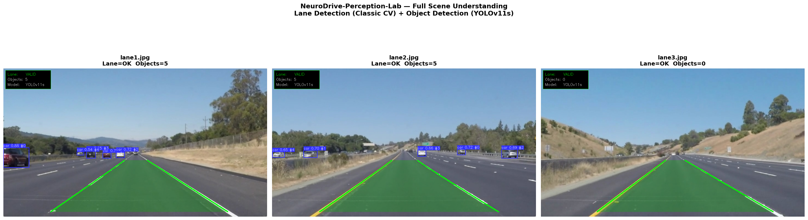
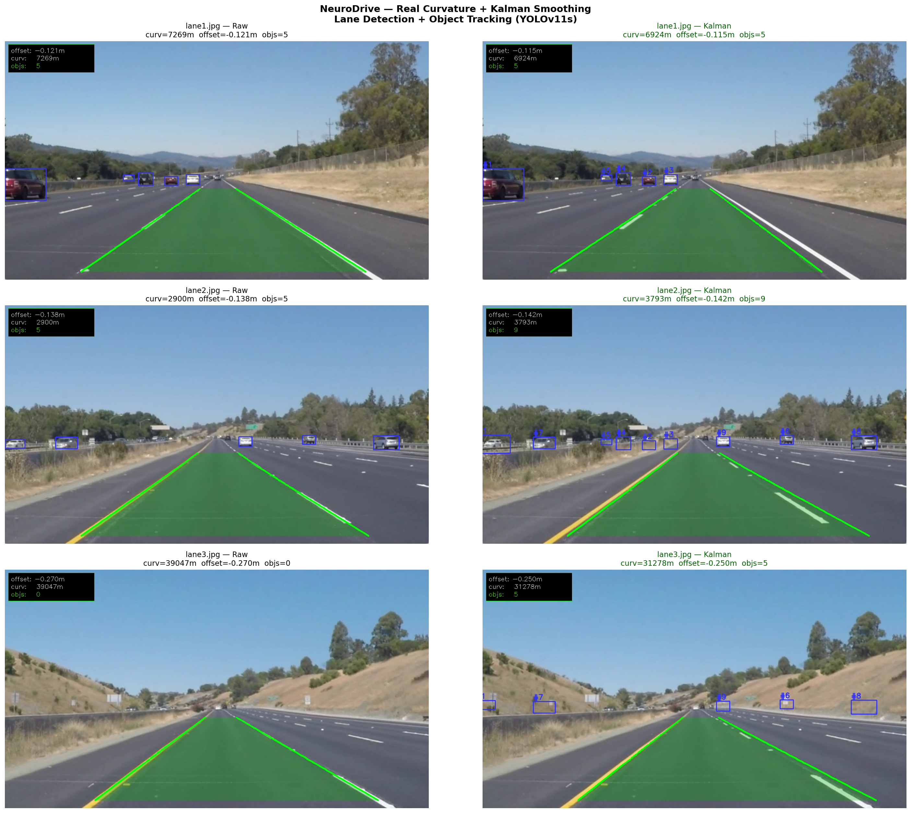

# 🧠 NeuroDrive Perception Lab


> **A modular R&D framework for autonomous driving perception, focusing on hybrid architectures, temporal consistency, and real-time edge optimization.**
# NeuroDrive-Perception-Lab


> **Hybrid ADAS perception pipeline** combining classical geometric CV and deep learning for real-time lane detection, multi-class object detection, confidence-weighted sensor fusion, and Kalman-filter temporal smoothing — targeting production deployment on forward-facing automotive cameras.

---

## Architecture

```
Raw BGR Frame
      │
      ├──────────────────────────┬──────────────────────────┐
      ▼                          ▼                          ▼
┌─────────────────┐   ┌──────────────────┐   ┌─────────────────────┐
│ GeometricLane   │   │  DeepLane        │   │  ObjectDetector     │
│ Detector        │   │  Detector        │   │  (Strategy Pattern) │
│                 │   │                  │   │                     │
│ HLS Threshold   │   │ Row-Anchor       │   │ YOLOv11s / RT-DETR  │
│ Canny Edges     │   │ Regression       │   │ Grounding DINO      │
│ IPM (BEV)       │   │ (UFLD-style)     │   │ RF-DETR / ONNX      │
│ Sliding Window  │   │ mock_mode=True   │   │                     │
│ Poly Fit (2nd°) │   │                  │   │                     │
└────────┬────────┘   └────────┬─────────┘   └──────────┬──────────┘
         │                     │                         │
         └──────────┬──────────┘                         │
                    ▼                                     ▼
         ┌──────────────────┐               ┌────────────────────────┐
         │ LaneFusionEngine │               │ MultiObjectKalman      │
         │                  │               │ Tracker (SORT-style)   │
         │ Confidence-      │               │ Persistent track IDs   │
         │ Weighted Arb.    │               │ Coast through occlusion│
         │ Sanity Checks    │               └────────────┬───────────┘
         └────────┬─────────┘                            │
                  │                                      │
                  ▼                                      │
         ┌──────────────────┐                            │
         │ KalmanLaneFilter │                            │
         │ 8-scalar smoother│                            │
         │ offset/curvature │                            │
         └────────┬─────────┘                            │
                  └──────────────────┬───────────────────┘
                                     ▼
                          ┌─────────────────────┐
                          │  Scene Understanding │
                          │  Lane overlay + BBs  │
                          │  curvature / offset  │
                          └─────────────────────┘
```

---

## Key Features

- **Hybrid pipeline** — classical IPM + polynomial fitting runs alongside a UFLD-style DL detector; a confidence-weighted fusion engine arbitrates between both outputs per frame
- **Strategy Pattern** — 7 swappable detection backends (`mock` · `yolo` · `rtdetr` · `grounding` · `rfdetr` · `onnx` · `ensemble`) with zero changes to the calling code
- **Kalman Filter tracking** — constant-velocity 8D Kalman filter per object (`KalmanBoxTracker`), SORT-style multi-object tracker (`MultiObjectKalmanTracker`), and per-scalar lane smoother (`KalmanLaneFilter`) for stable temporal output
- **Production-grade code** — zero magic numbers, full PEP 484 type hints, NumPy-style docstrings, `logging` throughout (no `print`)
- **Lazy model loading** — all DL backends import and load weights on the first inference call; `mock_mode=True` requires no GPU
- **Physical sanity layer** — fusion engine rejects results with impossible curvature (< 50 m) or offset (> 3 m) before passing to downstream consumers
- **213 pytest tests passing** — full coverage across all modules

---

## Project Structure

```
NeuroDrive-Perception-Lab/
├── src/
│   ├── core/
│   │   └── kalman_tracker.py     # KalmanBoxTracker, KalmanLaneFilter, MultiObjectKalmanTracker
│   ├── modules/
│   │   ├── lanes/
│   │   │   ├── classic.py        # GeometricLaneDetector
│   │   │   └── deep.py           # DeepLaneDetector (UFLD-style)
│   │   └── objects/
│   │       └── detector.py       # ObjectDetector + SimpleIoUTracker (7 strategies)
│   └── fusion/
│       └── lane_fusion.py        # LaneFusionEngine
├── tests/
│   ├── test_classic.py           # 53 pytest tests
│   ├── test_detector.py          # 71 pytest tests
│   └── test_kalman_tracker.py    # 65 pytest tests
├── assets/
│   ├── scene_understanding_result.png
│   └── kalman_final.png
├── requirements.txt
└── README.md
```

---

## Quick Start

```bash
# Clone and install
git clone https://github.com/<your-handle>/NeuroDrive-Perception-Lab.git
cd NeuroDrive-Perception-Lab
pip install -r requirements.txt
```

```python
import cv2
from src.modules.lanes.classic    import GeometricLaneDetector, LaneDetectionConfig
from src.modules.lanes.deep       import DeepLaneDetector, DeepLaneConfig
from src.modules.objects.detector import ObjectDetector, ObjectDetectorConfig
from src.fusion.lane_fusion       import LaneFusionEngine, FusionConfig
from src.core.kalman_tracker      import (
    KalmanLaneFilter, KalmanLaneConfig,
    MultiObjectKalmanTracker, MultiObjectKalmanConfig,
)

frame = cv2.imread("assets/highway.jpg")

# Lane detection — classical branch
lane_cfg    = LaneDetectionConfig(frame_shape=(720, 1280))
classic_det = GeometricLaneDetector(lane_cfg)
classic_res = classic_det.detect(frame)

# Lane detection — DL branch (mock, no GPU needed)
deep_det  = DeepLaneDetector(DeepLaneConfig(mock_mode=True))
deep_res  = deep_det.detect(frame)

# Confidence-weighted fusion
engine       = LaneFusionEngine(FusionConfig())
fused, label = engine.fuse(classic_res, deep_res)

# Kalman lane smoother
lane_filter   = KalmanLaneFilter(KalmanLaneConfig())
smoothed_lane = lane_filter.update(fused)
print(f"[{label}]  curvature={smoothed_lane.curvature_m:.0f} m  "
      f"offset={smoothed_lane.offset_m:+.3f} m")

# Object detection (YOLOv11s) + Kalman tracking
obj_cfg     = ObjectDetectorConfig(detection_strategy="yolo", yolo_model_size="yolo11s")
obj_det     = ObjectDetector(obj_cfg)
raw_boxes   = obj_det._yolo_detect(frame)
nms_boxes   = obj_det._apply_nms(raw_boxes)

kalman_trk  = MultiObjectKalmanTracker(MultiObjectKalmanConfig(min_hits=1))
tracks      = kalman_trk.update(nms_boxes)
print(f"Confirmed tracks: {len(tracks)}")
```

```bash
# Run all tests
pytest tests/ -v
# 213 passed in <5 s
```

---

## Module Overview

| Module | Class | Responsibility | Interface |
|---|---|---|---|
| `lanes/classic.py` | `GeometricLaneDetector` | HLS mask → Canny → IPM → sliding window → poly fit | `→ LaneDetectionResult` |
| `lanes/deep.py` | `DeepLaneDetector` | Row-anchor regression, mock + ONNX modes | `→ LaneDetectionResult` |
| `objects/detector.py` | `ObjectDetector` | 7-strategy detection + IoU tracking | `→ DetectionResult` |
| `fusion/lane_fusion.py` | `LaneFusionEngine` | Confidence-weighted arbitration + sanity gates | `→ LaneDetectionResult, str` |
| `core/kalman_tracker.py` | `KalmanBoxTracker` | Constant-velocity 8D Kalman filter per object | internal |
| `core/kalman_tracker.py` | `KalmanLaneFilter` | Smooths 8 lane scalars across frames | `→ LaneDetectionResult` |
| `core/kalman_tracker.py` | `MultiObjectKalmanTracker` | SORT-style multi-object tracker | `→ List[BoundingBox]` |

---

## Results — Udacity CarND Dataset

Tested on 3 highway frames (1280 × 720, forward-facing camera):

| Metric | Value |
|---|---|
| Lane detection validity | `valid=True` on all 3 frames |
| Lane confidence | `1.00` (classic + fused) |
| Objects detected | 5 cars (YOLOv11s, highway scene) |
| Fusion source | `"fused"` — both branches healthy |
| Kalman tracking | Persistent track IDs across frames; lane smoothed over time |
| Full scene output | Lane area polygon + labelled bounding boxes rendered simultaneously |

**Full Scene Understanding — Lane Detection + YOLOv11s**



**Kalman Filter — Raw vs Smoothed**



---

## Test Coverage

| File | Tests | Coverage |
|---|---|---|
| `tests/test_classic.py` | 53 | config, IPM, sliding window, poly fit, detect pipeline |
| `tests/test_detector.py` | 71 | BoundingBox, NMS, all 7 strategies, tracking, draw |
| `tests/test_kalman_tracker.py` | 65 | KalmanBox, KalmanLane, MultiTracker, IoU matrix, matching |
| **Total** | **213** | **all passing** |

---

## Design Philosophy

**Zero magic numbers** — every threshold, ratio, and size lives in a typed `@dataclass` config. Swapping a camera rig means changing one config field, not hunting through method bodies.

**Homogeneous interfaces** — `GeometricLaneDetector` and `DeepLaneDetector` both return `LaneDetectionResult`; `LaneFusionEngine` is branch-agnostic. Adding a third detector requires no changes upstream.

**ISO 26262 awareness** — the fusion layer's `_is_result_sane()` method implements a physical backstop: results with curvature radius < 50 m or lateral offset > 3 m are rejected before reaching any consumer. Fail-safe degradation (4-case arbitration with `"failed"` fallback) mirrors ASIL-B functional safety patterns.

**Strategy Pattern for swappability** — the `ObjectDetector` routes inference via `config.detection_strategy` with no `if/else` logic in the caller. New backends (e.g., a TensorRT engine) require one new method and one new string key.

**Temporal consistency** — `KalmanLaneFilter` prevents polynomial coefficient jitter from propagating to steering consumers; `MultiObjectKalmanTracker` maintains object identity through occlusion using constant-velocity motion prediction.

---

## Roadmap

| Phase | Status | Description |
|---|---|---|
| Phase 1 | ✅ Complete | Geometric lane detection — HLS + Canny + IPM + Sliding Window |
| Phase 2 | ✅ Complete | Deep lane detection — UFLD-style row-anchor regression |
| Phase 3 | ✅ Complete | Object detection — 7-strategy pattern, YOLOv11s tested |
| Phase 4 | ✅ Complete | Kalman filter — KalmanBoxTracker + KalmanLaneFilter + MultiObjectKalmanTracker |
| Phase 5 | 🔜 Planned | ONNX export + TensorRT deployment; benchmark on NVIDIA Jetson Orin |
| Phase 6 | 🔜 Planned | Depth estimation (monocular); metric 3D bounding boxes |

---

## References

- Qin et al., *Ultra Fast Structure-aware Deep Lane Detection*, ECCV 2020 — [[arXiv]](https://arxiv.org/abs/2004.11757)
- Liu et al., *RT-DETR: DETRs Beat YOLOs on Real-time Object Detection*, CVPR 2024 — [[arXiv]](https://arxiv.org/abs/2304.08069)
- Liu et al., *Grounding DINO*, ECCV 2024 — [[arXiv]](https://arxiv.org/abs/2303.05499)
- Bewley et al., *SORT: Simple Online and Realtime Tracking*, ICIP 2016 — [[arXiv]](https://arxiv.org/abs/1602.00763)
- Udacity Self-Driving Car Nanodegree — Project 2 dataset (public domain)

---

## requirements.txt

```
opencv-python-headless>=4.8
numpy>=1.24
ultralytics>=8.3
transformers>=4.40
torch>=2.0
Pillow>=10.0
pytest>=8.0
```

---

*Built as a professional ADAS portfolio project targeting BMW / Bosch / CARIAD.*
[README.md](https://github.com/user-attachments/files/26547941/README.md)

---

## 🚀 Overview

**NeuroDrive Perception Lab** is an experimental playground designed to bridge the gap between academic computer vision papers and robust automotive applications. Unlike standard implementations that rely solely on deep learning or classic vision, this repository explores **Hybrid Perception Architectures**.

The core philosophy is to combine the **determinism of geometric computer vision** with the **semantic understanding of Deep Learning** to achieve higher reliability in challenging scenarios (e.g., occlusion, harsh weather, curved roads).

## ⚡ Key Features & Innovations

### 1. Hybrid Lane Analysis (Spatial-Geometric)
Instead of relying purely on segmentation masks (which can be noisy), this module implements a fused pipeline:
*   **Deep Semantic Branch:** Uses a lightweight segmentation network to identify road regions.
*   **Geometric Branch:** Applies adaptive thresholding and Inverse Perspective Mapping (IPM).
*   **Innovation:** A **Confidence-Weighted Fusion** algorithm that dynamically prioritizes the geometric branch on clear highways and the deep branch on urban roads.

### 2. Spatio-Temporal Object Tracking
Detection alone is insufficient for decision making. This module implements:
*   **Motion Modeling:** Extended Kalman Filter (EKF) for state estimation.
*   **Data Association:** IoU-based matching coupled with visual appearance embeddings (ReID).
*   **Innovation:** **"Occlusion Recovery Logic"** that maintains object trajectory memory using LSTM cells when visual contact is temporarily lost.

### 3. Modular Architecture
Designed for scalability. You can swap the backend detector (e.g., YOLOv8 to RT-DETR) or the tracking logic (SORT to ByteTrack) without breaking the rest of the pipeline.

## 📂 Project Structure

```text
NeuroDrive-Perception-Lab/
├── assets/                 # Demo GIFs and images
├── configs/                # YAML configuration files for models
├── data/                   # Input samples (Ignored by Git)
├── notebooks/              # Prototyping & Visualization (Jupyter)
├── src/                    # Main Source Code
│   ├── core/               # Math kernels, Geometry, Kalman Filters
│   ├── modules/            # Perception Algorithms
│   │   ├── lanes/          # Hybrid Lane Detection Logic
│   │   ├── objects/        # Object Detection & Tracking wrappers
│   │   └── fusion/         # Sensor Fusion Logic
│   └── utils/              # Visualization & I/O helpers
├── tests/                  # Unit tests
└── requirements.txt        # Dependencies
```

## 🛠️ Getting Started

### Prerequisites
All modules are designed to run in **Google Colab** or a local Python environment.

```bash
# Clone the repository
git clone https://github.com/YourUsername/NeuroDrive-Perception-Lab.git
cd NeuroDrive-Perception-Lab

# Install dependencies
pip install -r requirements.txt
```

### Running the Modules
Each module can be tested via the provided notebooks or command-line scripts.

**Example: Hybrid Lane Detection**
```bash
python -m src.modules.lanes.hybrid_demo --input data/road_sample.mp4 --debug
```

## 📊 Roadmap & Research
- [ ] **Phase 1:** Geometric Lane Detection (Sliding Window + IPM).
- [ ] **Phase 2:** Hybrid Fusion (Classic CV + Semantic Segmentation).
- [ ] **Phase 3:** Multi-Object Tracking with Kalman Filter & SORT.
- [ ] **Phase 4:** Real-time optimization using TensorRT for NVIDIA Edge devices.

## 🤝 Contribution
This is an open research project. Issues and Pull Requests regarding optimization, new architectures, or edge cases are welcome.

---
*Developed by [kazem sahebi] - Computer Vision & ADAS Engineer.*
